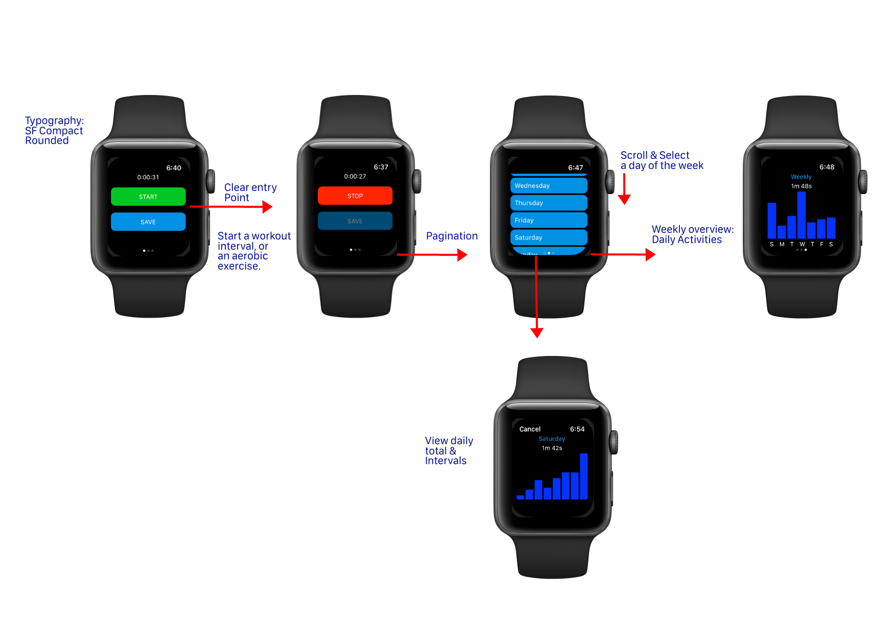
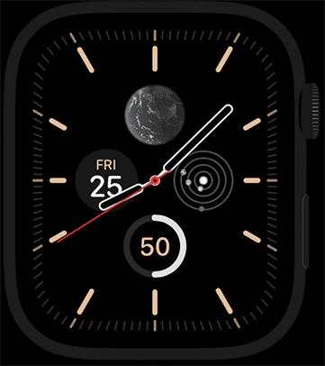

# 
iOS Illustrations II 

 

 <a href="https://developer.apple.com/swift/" target="_blank" rel="noreferrer"> &nbsp;&nbsp;&nbsp;&nbsp;&nbsp;&nbsp&nbsp; </a>  <a href="https://git-scm.com/" target="_blank" rel="noreferrer">  &nbsp;&nbsp;&nbsp;&nbsp;&nbsp;&nbsp&nbsp;</a>   

 

## Wearable Project: WatchOS

App Name: __Fitness Counts__

Main concepts: WatchOS workout tracker. Track and display work out time intervals for daily and weekly activities.

	

	
&nbsp;&nbsp;&nbsp;&nbsp;&nbsp;&nbsp&nbsp;&nbsp;&nbsp;&nbsp;&nbsp&nbsp&nbsp;&nbsp;
   

 
 

## News API App

__Goals__:

* Download and parse JSON from a news API
* Add activity indicators to display download progress
* Display sources with a UITableView
* Each section is displayed by category
* Cell selection will take the user to the Articles View
* Allow user to change the theme in settings
* Article cell selection will take the user to an article detail view
* Display website in a WKWebView

  
&nbsp;&nbsp;&nbsp;&nbsp;&nbsp;&nbsp&nbsp;&nbsp;&nbsp;&nbsp;&nbsp&nbsp&nbsp;&nbsp;

  
&nbsp;&nbsp;&nbsp;&nbsp;&nbsp;&nbsp&nbsp;&nbsp;&nbsp;&nbsp;&nbsp&nbsp&nbsp;&nbsp;

